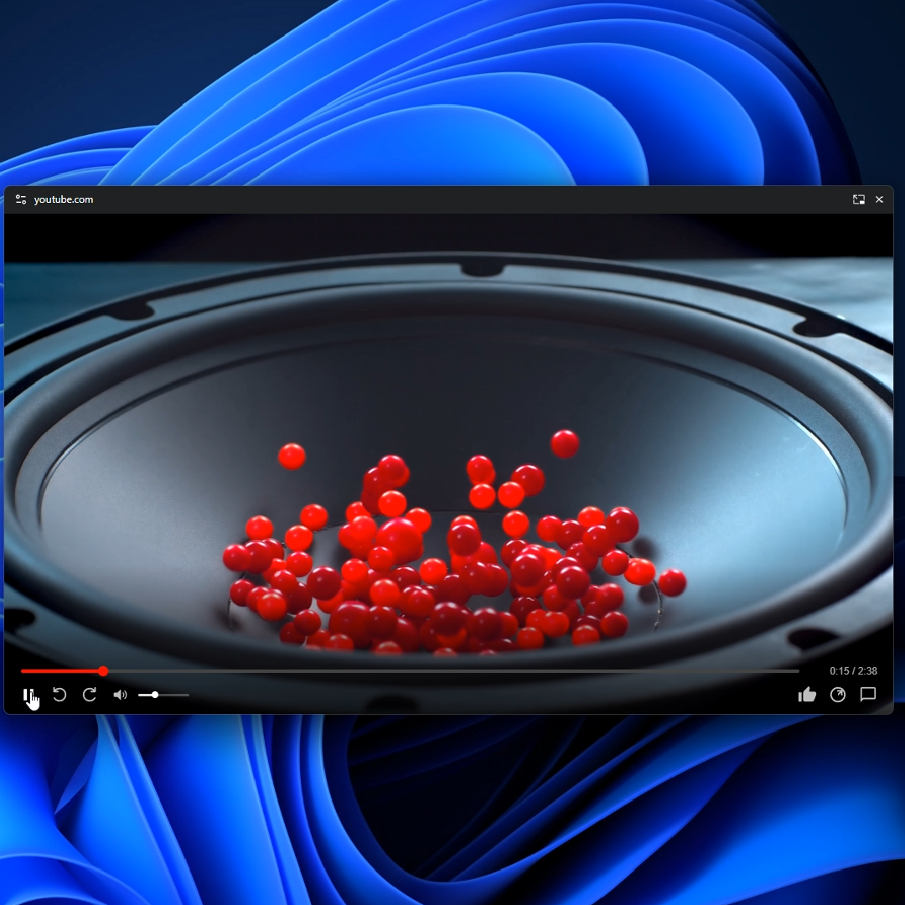

# STREAM-PIP

**Enhanced Picture-in-Picture for Twitch and YouTube.**

STREAM-PIP integrates Twitch chat and YouTube comments directly into your Picture-in-Picture window. Watch your favorite content without missing a single message.

  
  
  

### Installation

1. **Download**: Download this repository as a ZIP file.
2. **Extract**: Unzip the folder to a location on your computer.
3. **Load**: 
    * Open Google Chrome and navigate to `chrome://extensions/`.
    * Toggle **Developer mode** (top right corner).
    * Click **Load unpacked** and select the extracted folder.

  Created by Simon

